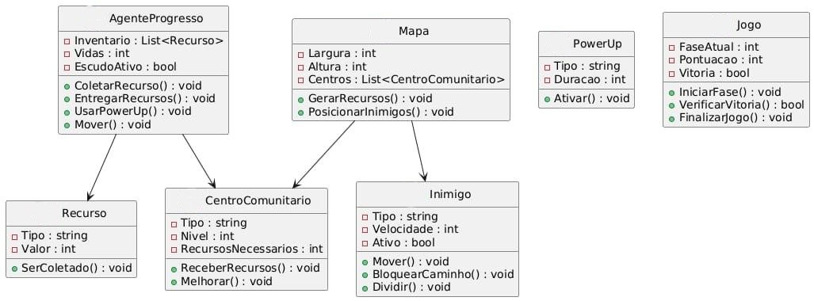

# WRS-Project

# 🎮 Pac-Man - A Missão Comunitária  

Uma reimaginação estratégica do clássico **Pac-Man**, onde o objetivo não é consumir, mas **construir**.  
O jogador assume o papel de um **Agente de Progresso**, levando recursos essenciais para uma comunidade, superando barreiras sociais e econômicas para ajudá-la a prosperar.  

---

## 🌍 Conceito  
- Inspirado no **ODS 1: Erradicação da Pobreza**.  
- Cada elemento do jogo é uma **metáfora para desafios e soluções sociais**.  
- Divertido, mas também projetado para **gerar reflexão**.  

---

## 🕹️ Jogabilidade  
### Fluxo Principal  
➡️ **Coletar Recursos** → **Entregar nos Centros Comunitários** → **Melhorar a Comunidade** → **Vencer**  

### Mecânicas  
- **Inventário Limitado**: O carrinho de entregas comporta apenas 5 itens, forçando planejamento estratégico.  
- **Entrega e Recompensa**: Pontos são ganhos somente ao entregar recursos nos locais corretos.  
- **Centros Comunitários**: Melhoram visualmente a cada entrega.

---

## 👤 Personagens  
### O Herói: *Agente de Progresso (Pac-Man)*  
- *Missão*: Levar esperança e recursos.  
- *Habilidade*: Coletar itens e usar power-ups estratégicos.  

### Os Inimigos: *As Barreiras (Fantasmas)*  
- *Desemprego*: Lento, mas bloqueia áreas importantes.  
- *Desigualdade*: Ao ser enfrentado, se divide em dois menores e mais rápidos.  
- *Falta de Acesso (Saúde/Educação)*: Fica invisível periodicamente.  
- *Crise Econômica*: Grande e raro, acelera todos os inimigos ao aparecer.  

---

## 📦 Recursos (Itens Colecionáveis)  
- *💰 Moedas*: Renda e acesso financeiro.  
- *🍎 Alimentos*: Combate à fome.  
- *📚 Livros*: Educação de qualidade.  
- *🧱 Tijolos*: Moradia e infraestrutura.  

---

## ⚡ Power-Ups (Soluções)  
- *🎓 Bolsa de Estudos*: Invencibilidade temporária.  
- *🏥 Posto de Saúde*: Vida extra ou escudo.  
- *🏦 Investimento Comunitário*: Remove todos os inimigos por alguns segundos.  

---

## 🏘 Cenário: O Mapa da Comunidade  
O labirinto representa uma comunidade, com *Centros Comunitários* espalhados:  
- Escola  
- Hospital  
- Mercado  
- Moradia  

---

## 🏆 Condição de Vitória  
- O jogador vence a fase quando *todos os Centros Comunitários atingem o nível máximo de desenvolvimento*.  
- Isso simboliza que a *comunidade se tornou autossuficiente*.  

---

## 🖼️ Diagrama de Classes  

O diagrama abaixo mostra a arquitetura principal do jogo **Pac-Man - A Missão Comunitária**, destacando as entidades, atributos e métodos:

---

# 🧪 Plano de Testes  

## 🎯 Objetivo  
Validar todos os requisitos funcionais e não-funcionais do jogo, garantindo que:  
- O ciclo **Coletar → Entregar → Evoluir → Vencer** funcione corretamente.  
- Inimigos e power-ups tenham o comportamento esperado.  
- HUD e interface exibam informações de forma clara.  
- O desempenho seja estável.  

---

## ⚙️ Abordagem  
- **Testes Funcionais (Caixa-Preta):** validar do ponto de vista do jogador.  
- **Análise de Valor-Limite:** verificar restrições numéricas (ex.: inventário máx. 5).  
- **Testes de Usabilidade:** clareza da interface e resposta dos controles.  
- **Testes de Desempenho:** FPS alvo de 60 em máquina de referência.  

---

## 📋 Requisitos Funcionais (RF)  
- **RF01:** Movimentação com teclado.  
- **RF02:** Inventário limitado a 5 itens.  
- **RF03:** 4 tipos de recursos (moedas, alimentos, livros, tijolos).  
- **RF04:** Entrega em 4 Centros (Escola, Hospital, Mercado, Moradia).  
- **RF05:** Evolução dos Centros a cada entrega.  
- **RF06:** 4 inimigos com comportamentos específicos.  
- **RF07:** 3 power-ups com efeitos temporários.  
- **RF08:** HUD com inventário, pontuação e progresso.  
- **RF09:** Salvar e carregar progresso (opcional MVP).  
- **RF10:** Vitória quando todos os Centros atingem o nível máximo.  

---

## 🧱 Requisitos Não-Funcionais (RNF)  
- **RNF01:** FPS estável (60 fps).  
- **RNF02:** Controles responsivos (<100ms).  
- **RNF03:** Código com lint + testes unitários no CI.  
- **RNF04:** Textos e ícones acessíveis; paleta daltônico-safe.  
- **RNF05:** Estrutura modular por pastas.  

---

## ✅ Casos de Teste (Exemplos)  

### CT01 – Movimentação do Jogador (RF01)  
- **Técnica:** Funcional (Caixa-Preta)  
- **Pré-condição:** Jogo iniciado.  
- **Passos:** Usar teclas direcionais e mover contra a parede.  
- **Esperado:** Movimento nas direções livres; bloqueio em paredes.  

### CT02 – Limite do Inventário (RF02)  
- **Técnica:** Análise de Valor-Limite  
- **Pré-condição:** Inventário com 4 itens.  
- **Passos:** Coletar 5º item, tentar coletar 6º.  
- **Esperado:** 5º aceito, 6º bloqueado com feedback visual/sonoro.  

### CT03 – Entrega e Evolução (RF04, RF05)  
- **Pré-condição:** Jogador com 1 item; Hospital no nível 1.  
- **Passos:** Entregar item no Hospital.  
- **Esperado:** +Pontuação, Hospital evolui p/ nível 2, inventário atualizado.  

### CT04 – Inimigo “Falta de Acesso” (RF06)  
- **Pré-condição:** Inimigo ativo.  
- **Passos:** Observar por 30s.  
- **Esperado:** Alterna visível/invisível periodicamente.  

### CT05 – Power-up “Bolsa de Estudos” (RF07)  
- **Pré-condição:** Inimigos ativos.  
- **Passos:** Coletar power-up, colidir com inimigos.  
- **Esperado:** Jogador invencível; inimigos fogem; removidos temporariamente; efeito expira após N segundos.  

## 🔍 Casos de Teste (Caixa-Branca – Exemplos)  

### Jogador  
- **`pode_ir()`**: validar dentro/fora dos limites; parede vs caminho.  
- **`mover()`**: aplicar direção; parar em parede; manter velocidade em input inválido.  
- **`coletar()`**: coleta apenas se inventário não estiver cheio; bloquear ao atingir 5 itens.  

### Centro Comunitário  
- **`receber_entrega()`**: soma itens corretos; respeita limite de nível máximo; retorna pontos esperados.  

### Inimigos  
- **`mover()`**: andar reto quando possível; mudar direção ao bloquear; inverter apenas em becos sem saída.  
- **Invisibilidade (Falta de Acesso):** alternar visível/invisível após tempo pré-definido.  
- **Dividir (Desigualdade):** dividir em dois menores e mais rápidos quando atingido.  

### HUD / Renderização  
- Smoke-test de funções de desenho (`pygame.draw`), garantindo que não lancem exceções (sem validar pixels).  

---